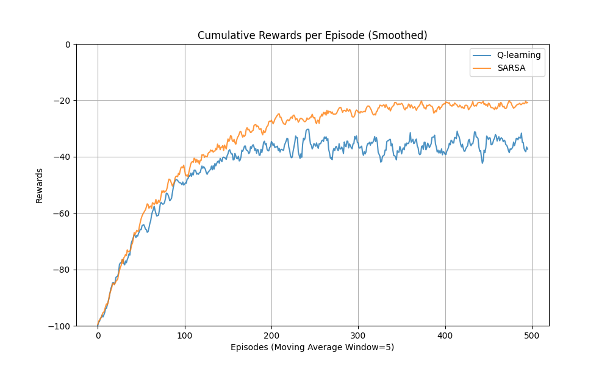
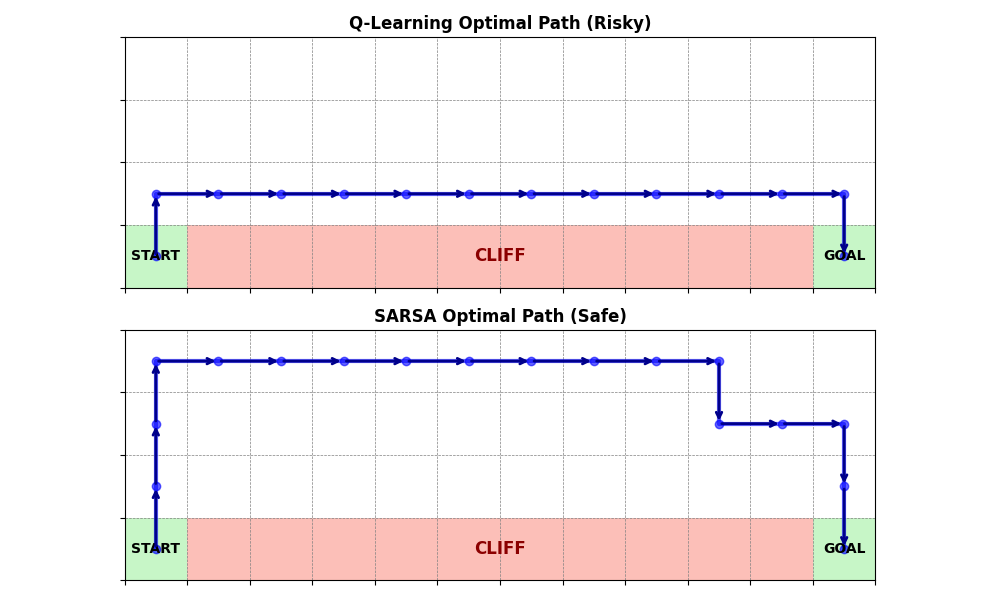
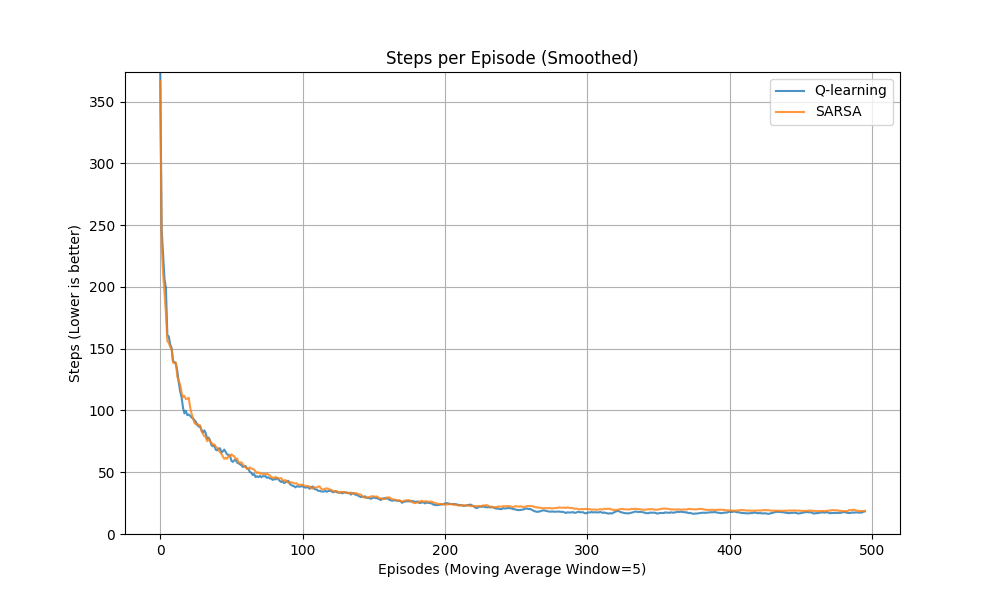
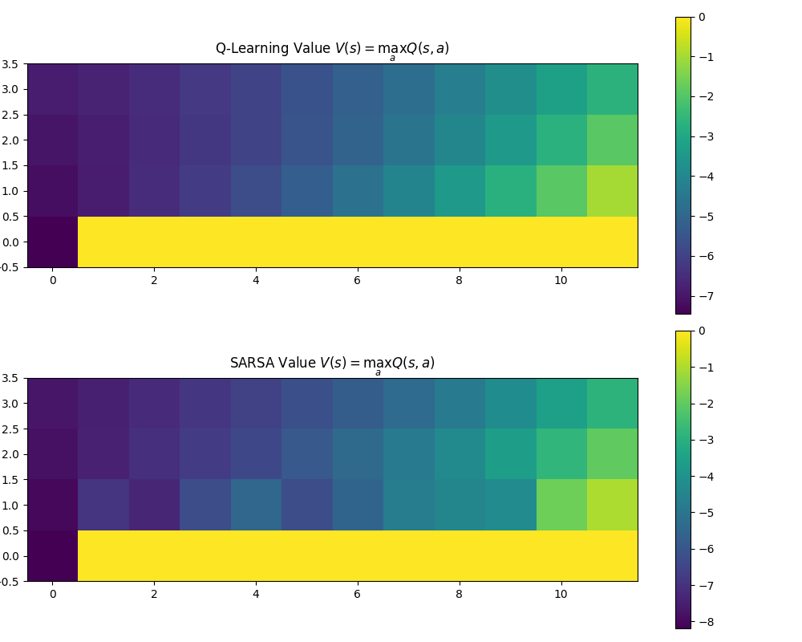

# Q-learning 與 SARSA 演算法之比較研究 (Cliff Walking)

## 📌 作業目的
本作業旨在實作並比較兩種經典的強化學習演算法：**Q-learning**（離策略方法，Off-policy）與 **SARSA**（同策略方法，On-policy）。透過在相同的「Cliff Walking」(4x12 網格) 環境與參數設定下進行測試，分析兩者的學習行為、收斂特性以及最終習得之策略差異。

## 🗺️ 環境與問題設定
本實驗採用經典的「Cliff Walking」網格世界（Gridworld）環境：
- **網格大小**：4 × 12
- **設定**：
  - 起點（Start）位於左下角 `(0, 0)`
  - 終點（Goal）位於右下角 `(11, 0)`
  - 起點與終點之間的底部區域為「懸崖（Cliff）」 `(1, 0)` ~ `(10, 0)`
- **狀態空間**：所有的網格位置表示為 `(x, y)`
- **動作空間**：上、下、左、右 (0, 1, 2, 3)
- **獎勵機制**：
  - 每移動一步：`-1`
  - 掉入懸崖：`-100`，並立刻回到起點
  - 到達終點：回合結束

## ⚙️ 演算法與訓練參數
- 使用 **ε-greedy** 策略來探索環境，$\epsilon = 0.1$
- 學習率 $\alpha = 0.1$
- 折扣因子 $\gamma = 0.9$
- **訓練試驗**：為了降低探索帶來的隨機性雜訊並獲得更客觀的比較基準，本程式採用 **50次獨立訓練試驗**，每次試驗均讓兩個代理各獨立執行 **500回合(Episodes)**，並對結果進行累積加總平均。

## 📊 結果分析與理論討論

### 1. 學習表現與收斂速度
下圖為 50 次獨立試驗平均後的每一回合累積獎勵（Total Reward）平滑曲線：

- **SARSA (On-policy)**：由於在評估時會考慮當前 $\epsilon$-greedy 的隨機探索機率，因此在前期的學習過程中，SARSA 會較快發現懸崖邊的危險性並做出調整，整體累積獎勵提昇得較穩定且較快收斂到安全區間。
- **Q-learning (Off-policy)**：因為在更新 $Q$ 值時，總是假設自己未來會挑選「最大」利潤的動作（即緊貼懸崖的最佳捷徑），而忽略了當下 $\epsilon$-greedy 探索時可能隨機掉崖的風險。因此在訓練期間，它頻繁因為探索機制而掉下懸崖，導致平均累積獎勵在前期至中後期都大幅低於 SARSA。

### 2. 策略行為比對
經過上述學習後，將最終收斂的 Q-table 貪婪地（不包含 $\epsilon$ 探索）視覺化出兩者計算出的最佳路徑：

- **Q-learning 的最終路徑 (上半圖)**：呈現為一條極度冒險但理論長度最短的捷徑。它選擇緊緊貼著懸崖邊緣直線前進。
- **SARSA 的最終路徑 (下半圖)**：呈現為一條保守且安全的外部道路。它選擇刻意繞遠路，與懸崖保持至少一到兩步的緩衝安全距離，來避免受隨機探索而掉落的極大懲罰。

### 3. 理論差異總結
- **Q-learning** 屬於離策略方法，更新基於「理論上的最佳行動」（$\max_{a'} Q(s',a')$），因此能學會全局最佳策略（最短路徑）。但在具有隨機探索的實際訓練過程中，這條緊貼懸崖的路徑**極具風險**。
- **SARSA** 屬於同策略方法，更新基於「實際採取的行動」（包含隨機探索的動態），因此它會將探索帶來的掉崖風險納入考量，從而學會一條在有探索機率時更為**安全、穩定**的次佳路徑。

### 4. 每回合步數比較 (Steps per Episode)
除了累積獎勵，我們也可以透過觀察「每回合抵達終點所需的總步數」來比較兩者的收斂狀況：

- 兩者在訓練後期都能非常快速地抵達終點。但因為 Q-learning 選擇的是最短的高風險捷徑，因此它的最少所需步數會略少於會刻意繞遠路的 SARSA。

### 5. 狀態價值熱力圖 (Value Heatmaps)
我們同樣可以將訓練完畢的 Q-Table 視覺化出其最大的價值分佈 $V(s) = \max_a Q(s,a)$：

- **Q-Learning**：熱力圖顯示越靠近起點與終點的連線（包含靠近懸崖邊緣的主幹道）價值越高。這證明了它將緊貼懸崖的格子視為高價值路徑。
- **SARSA**：熱力圖顯示安全區域（離懸崖較遠的上方）的價值較高，而靠近懸崖邊緣的區域價值，因為頻繁受到探索掉入懸崖的懲罰而被大幅壓低。這直接解釋了代理為什麼會自發性地選擇繞路的策略。

## 💡 最終結論
1. **收斂與穩定度**：SARSA 在帶有隨機探索的真實訓練過程中**表現更穩定**，因為它選擇了安全路徑，掉下懸崖的次數較少，累積報酬穩定度遠高於 Q-learning。
2. **最佳化偏好**：Q-learning 收斂目標為尋找**理論最佳解（最短路徑）**，但在部署環境存在干擾或操作誤差（如隨機嘗試）時容易發生重大失誤。
3. **應用情境的選擇**：
   - 當錯誤成本極高且訓練/線上執行過程中的失誤會造成巨大損失時，應選擇 **SARSA**。
   - 若只是在純模擬環境中訓練，且最終上線部署時會「完全關閉隨機探索 ($\epsilon=0$)」，則應選擇 **Q-learning** 以獲取極限最佳表現。
